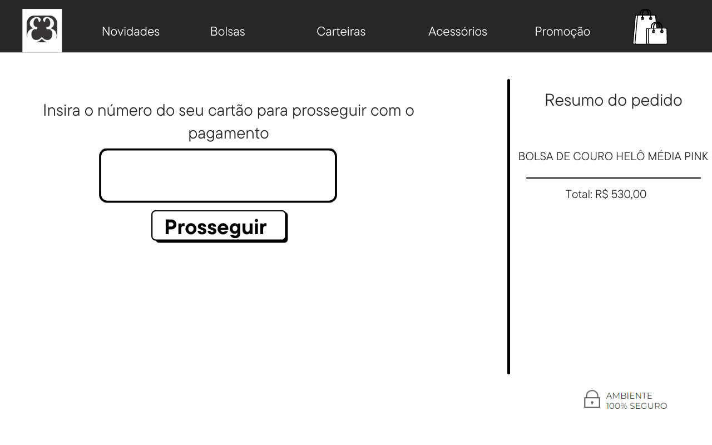

# Cartão de Crédito Válido

## Índice

- [1. Introdução](#1-Introdução)
- [2. Resumo do projeto](#2-resumo-do-projeto)
- [3. Planejamento](#3-planejamento)
- [4. Considerações técnicas](#4-consideracoes-técnicas)
- [5. Como usar](#5-como-usar)

---

## 1. Introdução

As compras online estão cada vez mais comuns e não param de crescer. Segundo uma pesquisa realizada com os dados de compra no e-commerce durante o primeiro trimestre de 2021, online no Brasil cresceram. Foram realizadas, segundo a pesquisa, 78,5 milhões de compras online no três primeiros meses do ano, um aumento de 57,4% em comparação ao mesmo período do ano passado.

[Fonte](https://www.ecommercebrasil.com.br/noticias/primeiro-trimestre-de-2021-vendas-alta-de-57/#:~:text=Foram%20realizadas%2078%2C5%20milh%C3%B5es,2%25%20na%20compara%C3%A7%C3%A3o%20com%202020.)

Atrelado a este aumento, o uso de cartões passou a ser cada vez maior em sites de compras. A tendência é estar nas redes e vender virtualmente, mas para isso, as lojas virtuais precisam garantir a segurança da transação e evitar golpes com cartões de créditos inválidos. Para evitar este tipo de problema uma solução seria um programa que valide o cartão do usuário antes de finalizar a compra.

## 2. Resumo do projeto

Esta página é uma simulação do validador em funcionamento. Este validador usa como cálculo o Algoritmo de Luhn.
A ideia é que o programa seja usado por qualquer tipo de e-commerce. Após preencher todos os dados pessoais, o usuário será redirecionado para a página que irá validar o cartão. Os números impressos no cartão serão digitados e o programa verificará se é válido ou não.
Se válido, a compra pode ser concluída na página de pagamento. Se não, a página informará que o número é inválido.  

Esta validação do cartão de crédito é o primeiro passo para aceitar um pagamento com cartão. Após esta validação, os dados do cartão serão enviados para a empressa emissora que irá autorizar a transação ou não (caso o cartão esteja expirado ou outros motivos).

## 3. Planejamento

A primeira fase do planejamento foi destrinchar as etapas necessárias para a conclusão do projeto. A organização de cada Sprint foi feita por meio do [Trello](https://trello.com/b/zCpXX0RI/projeto-1-cardvalidation).

Além do planning, foi elaborado um protótipo inicial que sofreu poucas alterações até o resultado. O protótipo foi feito usando como exemplo a finalização de uma compra em um site de uma marca de bolsas e acessórios. A finalização da compra se dará após a validação destes números.

## 4. Considerações Técnicas

O projeto consiste em duas funções "isValid" e "maskify". 
**isValid**: Função que verifica se os números digitados atendem aos cálculos realizados segundo o Algoritmo de Luhn. Se os números digitados atenderem aos cálculos, o retorno será "Cartão Válido", se não o retorno será "Cartão Inválido", assim como quando digitados espaços, letras ou caracteres especiais.

**maskify**: Se o cartão for válido, esta função irá ocultar os dígitos do cartão, exceto os quatro último e retornará ao usuário.

## 5. Como usar

- Clonar o projeto

` $ git clone https://github.com/GabrielaMedrado/SAP007-card-validation.git `

- Instalar as dependências do projeto

` $ npm install ` 

- Iniciar a aplicação

` $ npm start `

- Realizar os testes unitários

` $ npm test `

